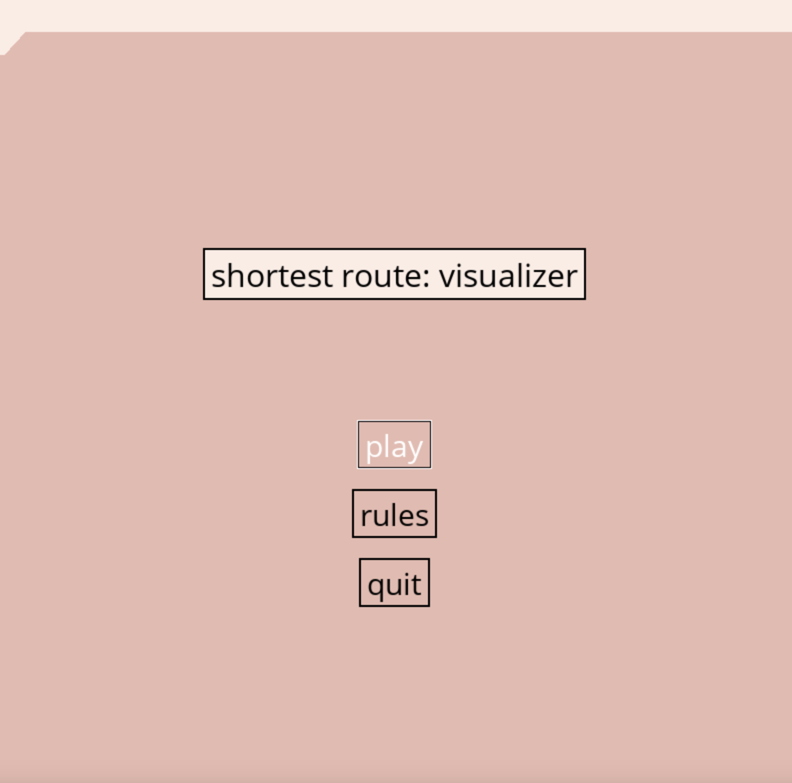
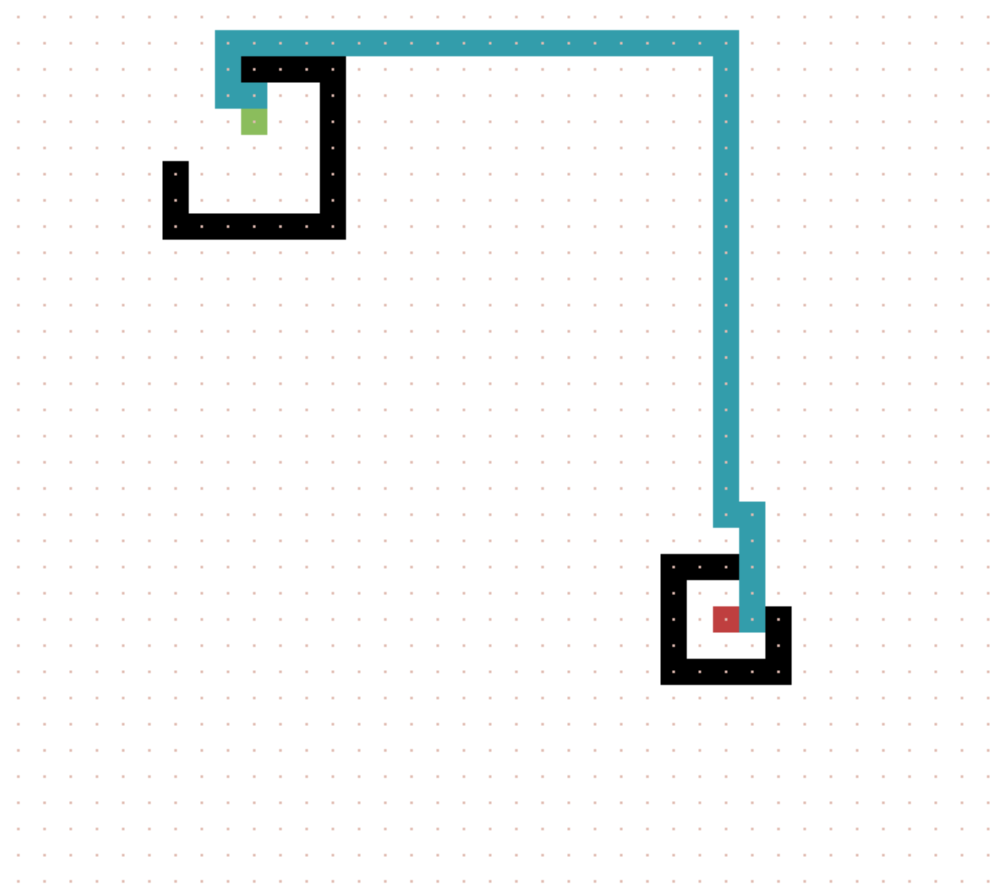

## Demo
[Video Description](https://youtu.be/ZnjeGm4yMKo)


## About the Project
In this project, I developed a simple visualization game that allows the user to find the optimal route between a start and end destination, and set barriers that the path cannot cross. The program uses A* search the find the shortest route, and a Manhattan distance heuristic. 

Menu             |  Route-Finder In Action
:-------------------------:|:-------------------------:
  |  

## Local Setup / Getting Started

1. Clone the repository in your terminal:
```
https://github.com/allisonhongberkeley/shortest-route-finder.git
```
2. Make sure you are in the path-visualizer directory. Then, install / create the virtual environment. 
```
pip3 install virtualenv
python<version> -m venv env
```
3. Activate the virtual environment. 
```
source env/bin/activate
```
3. To install all dependencies, run:
```
pip3 install -r requirements.txt
```
4. To start the game, run:
```
python3 main.py
```

## Usage

- Click 'Play'.
Follow the step-by-step instructions below to run the simulation. 
- First, set a starting point. To do so, hover over a point in the grid and click 's'. The start point will turn <ins>green</ins>. 
- Next, set an ending point. Hover over a <u>different</u> grid point and 'click 'e'. The end point will turn <ins>red</ins> . 
- (optional) Set barriers. Hover over any number of points and click 'b'. Barriers will turn <ins>black</ins>.
- (optional) To reset a block, hover over it and click 'r'.
- To run the route-finder, click 'p'. 
- To reset the entire board, click 'a'. 
